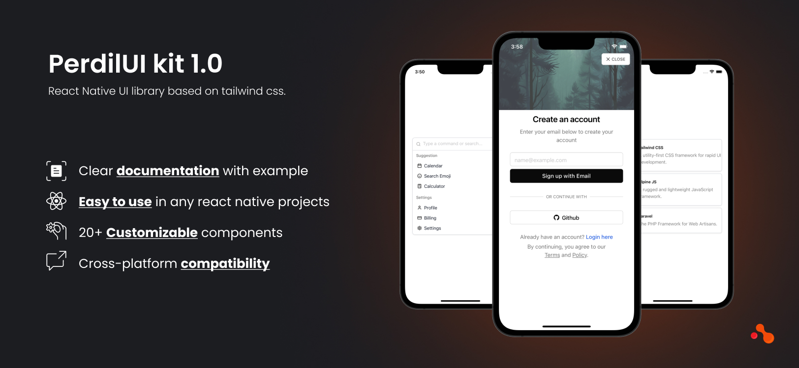

# Perdil UI Kit

Perdil UI Kit is a React Native UI Library that allows you to create stunning multi-brand cross-platform mobile applications. The library brings consistency and scalability in the design and development process.




## What's included
- 20+ general-purpose components designed and tested to save your time.
- Comprehensive clear documentation with tons of examples.
- Construct an interface using basic components ,specifications and it will always have a stunning design.

## Quick Start
### 1. Install
```bash
npm i perdil-ui
```
or
```bash
yarn add perdil-ui
```

### 2. Setup Tailwind CSS
Run `npx tailwindcss init` to create a `tailwind.config.js` file
Add the paths to all of your component files in your `tailwind.config.js` file.

```diff
// tailwind.config.js

module.exports = {
-   content: [],
+   content: ['./App.{js,jsx,ts,tsx}', './node_modules/perdil-ui/index.{js,jsx,ts,tsx}', './node_modules/perdil-ui/src/components/*.{js,jsx,ts,tsx}', './node_modules/perdil-ui/src/components/**/*.{js,jsx,ts,tsx}'],
    theme: {
        extend: {},
    },
    plugins: [],
}
```

### 3. Add the Babel plugin
Modify your `babel.config.js`.

```diff
// babel.config.js
module.exports = {
    presets: ['module:metro-react-native-babel-preset'],
+   plugins: ['nativewind/babel'],
};
```

### 4. Usage
Render the `Accordion` component for example.

```javascript
// App.jsx
import React from 'react';
import { Accordion, AccordionItem } from 'perdil-ui';

const App = () => {
  return (
    <Accordion>
      <AccordionItem
        heading={'What is Perdil UI Kit?'}
        content={'Perdil UI Kit is a UI library built for React Native using TailwindCSS.'}
      />
      <AccordionItem
        heading={'How do I install Perdil UI Kit?'}
        content={'Add Perdil UI Kit library and then use any of the elements into your project.'}
      />
      <AccordionItem
        heading={'Can I use Perdil UI Kit with other libraries?'}
        content={'Absolutely! Perdil UI Kit works with any other library.'}
      />
    </Accordion>
  );
}

export default App;
```

## License
[ISC](https://github.com/acquaint-softtech/perdilUI/blob/main/LICENSE.txt) license.

## From Developers
Made with ❤️ by [Acquaint team](https://acquaintsoft.com/)
